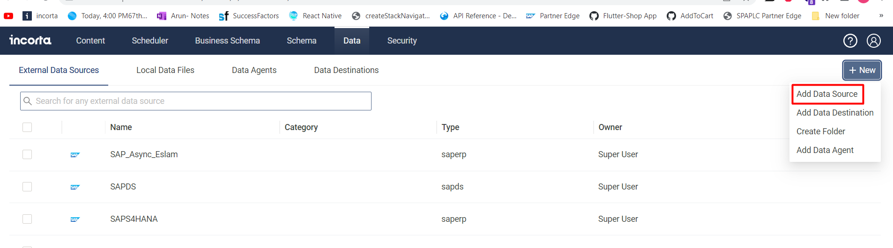
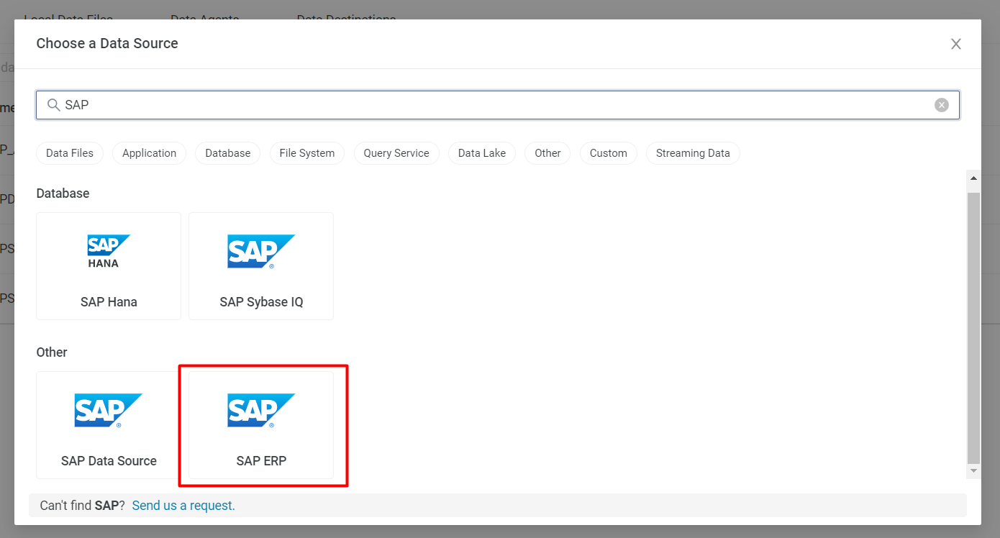

# Configure SAP Server in Incorta

Open the Incorta Analytics server and login to the tennat.

For this documentation, i am going to use the following server.

**Incorta Server**: http://35.162.194.145:8080/incorta/#/login

**Tenant name**: sapecc740_conntest_async_sd

Use your user credentials to login to the incorta analytics server.

Go to the `Data` tab section and Click on `Add` button to add new `Datasource`.

Search for the available SAP datasources and select `SAP ERP`.

Enter the following Details.

| Attribute                         | Value                       |
| :-------------------------------- | :-------------------------- |
| Connection Name                   | Test                        |
| SAP Application Server Host       | 35.165.82.157               |
| SAP System Number                 | 00                          |
| SAP Client                        | 800                         |
| User ID                           | IDA_EXT_USR                 |
| Password                          | \*\*\*\*                    |
| BAPI Name                         | ZINC_SAP_ERP_DATA_EXTRACTOR |
| Peak Limit                        | 300                         |
| Pool Capacity                     | 3                           |
| Metadata Cache Time               | 1                           |
| Extraction Method                 | Asynchronous                |
| Process At Incorta                | Disabled                    |
| Keep files for Debugging          | Disabled                    |
| Enable Encryption                 | Disabled                    |
| Datasource Timezone               | UTC                         |
| Asynchronous File Transfer Method |                             |
| Use Data Agent                    | Disabled                    |

Enter the File Transfer method details based on the Set up choice decided for Asynchronous extraction.

Click on Test Connection to see if you are getting success response. If the response is success click on Ok to save the Test Connection.
