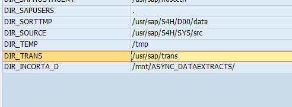
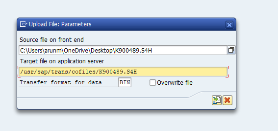
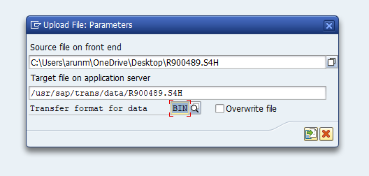
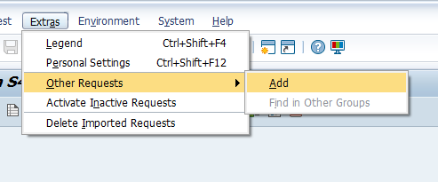
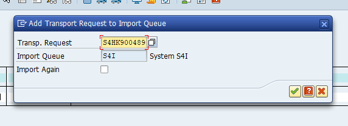
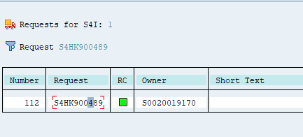
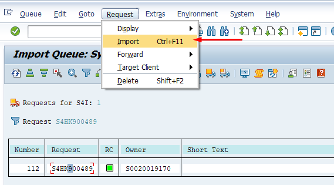
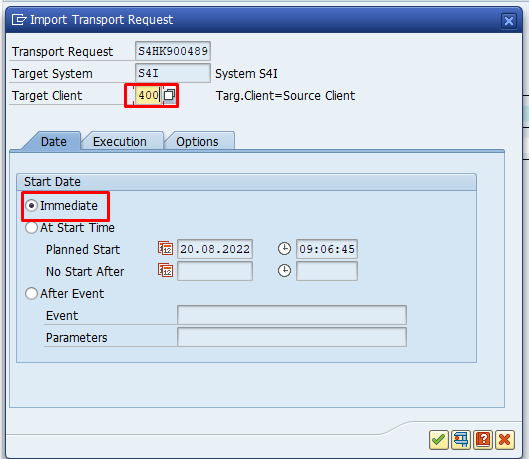
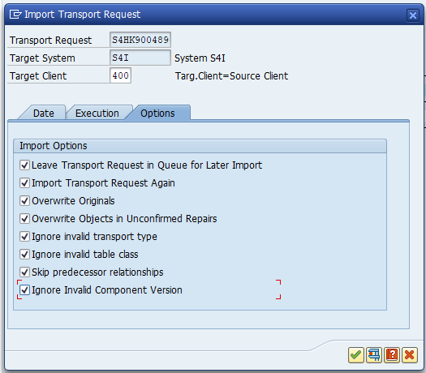

# Install SAP Plugins

To install the SAP Connector, navigate to the transport files section of the connector you would like to install and download the transport files.
The Zip files will contains two files:

1. The file name begins with K represent the `cofiles` file
2. The file name begins with R represent the `data` file

### Pre-requisites

To upload the transport files, we need to know the location where the SAP transport manager is configured to read the transport files.
To get the location, navigate to transaction code `AL11`.

Find the directory path configured for parameter name `DIR_TRANS`.

Example: `DIR_TRANS /usr/sap/trans`

### Upload the transport Files

To upload the transport files in the server, unzip the files and keep it ready.

**Step 1:** Upload the files

Open transaction code `CG3Z`.

a) Upload the cofiles.

In the source directory, choose the file from your device. Make sure you select the file that starts with the name `K`.

In the target directory specify the path of file location to upload the files.
To form the file location, append the folder cofiles with the transport directory path and add the file name that begins with `K`.

For example:

`/usr/sap/trans/cofiles/K000000.EHP`

b) Upload the data file.

Follow the similar step above and select the Data file. In the directoy path append the folder name as data as mentioned below
and select the file name that starts with `R`.

`/usr/sap/trans/data/R000000.EHP`

**Step 2**: Import the transport files.

To import the transport files, open transaction code `STMS_IMPORT` and add the transport files.

From the menu section, choose the option, `Extras->Other Requests->Add`.

Enter the transport number and click ok.

In the list of the `STMS_IMPORT` you should now see the transport file added to the import list.
You can filter the list by transport number.

Place the cursor on the transport and choose the menu option `Transport->Import`.

In the confirmation pop-up, enter the client number of the server, this is important to import the customizing data and leave the default option to `Immediate`.

In the options section, select all the options to avoid import errors.

Click on Okay, this will import the transport in few mins.
